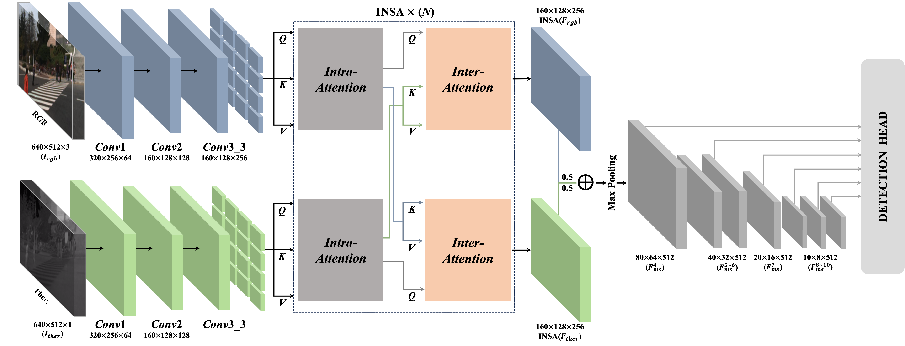
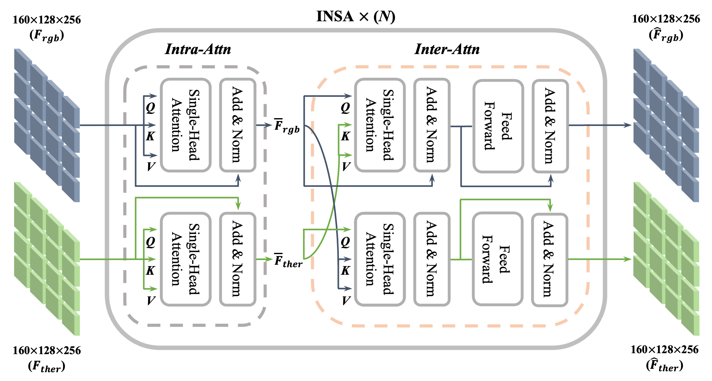
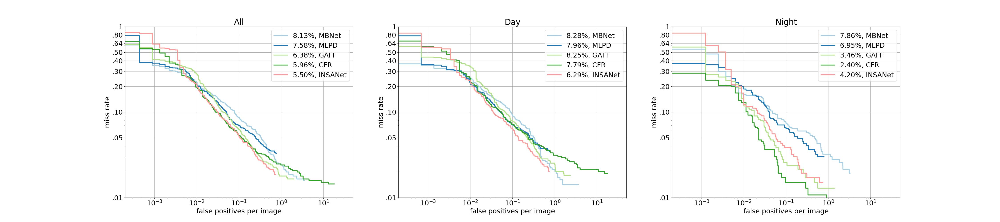

# INSANet: INtra-INter Spectral Attention Network for Effective Feature Fusion of Multispectral Pedestrian Detection

## Official Pytorch Implementation of [INSANet: INtra-INter Spectral Attention Network for Effective Feature Fusion of Multispectral Pedestrian Detection](https://www.mdpi.com/1424-8220/24/4/1168)
#### Authors: [Sangin Lee](https://sites.google.com/rcv.sejong.ac.kr/silee/%ED%99%88), [Taejoo Kim](https://sites.google.com/view/xown3197), [Jeongmin Shin](https://sites.google.com/view/jeongminshin), [Namil Kim](https://scholar.google.com/citations?user=IYyLBQYAAAAJ&hl=ko&oi=sra), [Yukyung Choi](https://scholar.google.com/citations?user=vMrPtrAAAAAJ&hl=ko&oi=sra)

##### 📢Notice : Multispectral Pedestrian Detection Challenge Leaderboard is available.
 [](https://eval.ai/web/challenges/challenge-page/1247/leaderboard/3137)

[](https://paperswithcode.com/sota/multispectral-object-detection-on-kaist?p=insanet-intra-inter-spectral-attention)
[](https://paperswithcode.com/sota/pedestrian-detection-on-llvip?p=insanet-intra-inter-spectral-attention)


<p align="center"></p>
<p align="center"></p>

## Abstract
Pedestrian detection is a critical task for safety-critical systems, but detecting pedestrians is challenging in low-light and adverse weather conditions. Thermal images can be used to improve robustness by providing complementary information to RGB images. Previous studies have shown that multi-modal feature fusion using convolution operation can be effective, but such methods rely solely on local feature correlations, which can degrade the performance capabilities. To address this issue, we propose an attention-based novel fusion network, referred to as INSANet (INtra- INter Spectral Attention Network), that captures global intra- and inter-information. It consists of intra- and inter-spectral attention blocks that allow the model to learn mutual spectral relationships. Additionally, we identified an imbalance in the multispectral dataset caused by several factors and designed an augmentation strategy that mitigates concentrated distributions and enables the model to learn the diverse locations of pedestrians. Extensive experiments demonstrate the effectiveness of the proposed methods, which achieve state-of-the-art performance on the KAIST dataset and LLVIP dataset. Finally, we conduct a regional performance evaluation to demonstrate the effectiveness of our proposed network in various regions.

> **PDF**: [INSANet: INtra-INter Spectral Attention Network for Effective Feature Fusion of Multispectral Pedestrian Detection](https://www.mdpi.com/1424-8220/24/4/1168/pdf)

---

## Usage

## Recommended Environment
- OS: Ubuntu 20.04
- CUDA-cuDNN: 11.3.0-8
- GPU: NVIDIA-A100
- Python-Torch: 3.7-1.11.0
  
See [environment.yaml](https://github.com/sejong-rcv/INSANet/blob/main/environment.yaml) for more details

## Installation
The environment file has all the dependencies that are needed for INSANet.

We offer guides on how to install dependencies via docker and conda.

First, clone the repository:
### Git Clone
```
git clone https://github.com/sejong-rcv/INSANet.git
cd INSANet
```

### 1. Docker
- **Prerequisite**
  - [nvidia-container-toolkit](https://github.com/NVIDIA/nvidia-container-toolkit)
  - Note that nvidia-cuda:11.3.0 is deprecated. See [issue](https://github.com/NVIDIA/nvidia-docker/issues/1745).
 ```
cd docker
make docker-make
```

- **Make Container**
 ```
cd ..
nvidia-docker run -it --name insanet -v $PWD:/workspace -p 8888:8888 -e NVIDIA_VISIBLE_DEVICES=all --shm-size=32G insanet:maintainer /bin/bash
```

### 2. Conda
- **Prerequisite**
  - Required dependencies are listed in environment.yaml.
```
conda env create -f environment.yml
conda activate insanet
```

If your environment support CUDA 11.3,
```
conda env create -f environment_cu113.yml
conda activate insanet
```

---

## Dataset
The datasets used to train and evaluate model are as follows:
- [KAIST Multispectral Pedestrian Detection Benchmark](https://github.com/SoonminHwang/rgbt-ped-detection)
- [LLVIP: A Visible-infrared Paired Dataset for Low-light Vision](https://github.com/bupt-ai-cz/LLVIP)

The dataloader in [datasets.py](https://github.com/sejong-rcv/INSANet/blob/main/src/datasets.py) assumes that the dataset is located in the data folder and structured as follows:

### KAIST
- First, you should download the dataset. we provide the script to download the dataset (please see data/download_kaist).
- Train: We use paired annotations provided in [AR-CNN](https://github.com/luzhang16/AR-CNN).
- Evaluation:  We use sanitized (improved) annotations provided in [MSDS-RCNN](https://github.com/Li-Chengyang/MSDS-RCNN).
```
├── data
   └── kaist-rgbt
      ├── annotations_paired
         ├── set00
            ├── V000
               ├── lwir
                  ├── I00000.txt
                  ├── ...
               ├── visible
                  ├── I00000.txt
                  ├── ...
            ├── V001
               ├── lwir
                  ├── I00000.txt
                  ├── ...
               ├── visible
                  ├── I00000.txt
                  ├── ...
            └── ...
         ├── ... (set02-set10)
         └── set11
            ├── V000
               ├── lwir
                  ├── I00019.txt
                  ├── ...
               ├── visible
                  ├── I00019.txt
                  ├── ...
      ├── images
         ├─ The structure is identical to the "annotations_paired" folder:
         └─ A pair of images has its own train annotations with the same file name.

├── src
   ├── kaist_annotations_test20.json
   ├── imageSets
      ├── train-all-02.txt # List of file names for train.
      └── test-all-20.txt 
```

### LLVIP
- First, you should download the dataset. Please see download_dataset.md in [LLVIP](https://github.com/bupt-ai-cz/LLVIP).
- A pair of visible and infrared images share the same annotation with the same file name.
- The annotations are in VOC format and we evaluate in annotations that have been modified to COCO format.
- **We also provide source code for train and evaluate for the LLVIP dataset. Please set the appropriate path.**
```
├── data
   └── LLVIP
      ├── Annotations
         ├── 010001.xml
         ├── 010002.xml
         ├── ...
         ├── 260535.xml
         └── 260536.xml
      ├── infrared
         ├── train
            ├── 010001.jpg
            ├── 010002.jpg
            ├── ...
            └── 250423.jpg
         └── test
            ├── 190001.jpg
            ├── 190002.jpg
            ├── ...
            └── 260536.jpg
      └── visible
         └─ The structure is identical to the "infrared".
├── llvip
   ├── LLVIP_annotations.json # COCO format annotation for evaluation.
   ├── LLVIP_train_all.txt    # Same as KAIST,
   ├── LLVIP_test_all.txt     # We classify and provide text files for train and test.
   └── src
      ├── config.py
      ├── datasets.py
      ├── train_eval.py
      └── inference.py
```

---

## Demo
Our pre-trained model on the KAIST dataset can be downloaded from [pretrained/download_pretrained.py](https://github.com/sejong-rcv/INSANet/blob/main/pretrained/download_pretrained.py) or [google drive](https://drive.google.com/file/d/1C56Jq1K2TuXFAp9f5UDkSF7Y-FucAG0L/view).

You can infer and evaluate a pre-trained model on the KAIST dataset as follows the below.
```
python pretrained/download_pretrained.py
mv pretrained.pth.tar pretrained
sh src/script/inference.sh
```

---

## Train & Inference
All train and inference scripts can be found in [src/script/train_eval.sh](https://github.com/sejong-rcv/INSANet/blob/main/src/script/train_eval.sh) and [src/script/inference.sh](https://github.com/sejong-rcv/INSANet/blob/main/src/script/inference.sh).

We provide a per-epoch evaluation in the training phase for convenience.
However, you might see OOM in the early epoch so the per-epoch evaluation is proceed after 10 epochs.

```
cd src/script
sh train_eval.sh
```

If you want to identify the number of (multiple) GPUs and THREADs, add 'CUDA_VISIBLE_DEVICES' and 'OMP_NUM_THREADS'(optional).
```
CUDA_VISIBLE_DEVICES=0,1 OMP_NUM_THREADS=1 python src/train_eval.py
```

---

## Evaluation
If you only want to evaluate, please see the scripts in [src/utils/evaluation_script.sh](https://github.com/sejong-rcv/INSANet/blob/main/src/utils/evaluation_script.sh) and [src/utils/evaluation_scene.sh](https://github.com/sejong-rcv/INSANet/blob/main/src/utils/evaluation_scene.sh).

As mentioned in the paper, we evaluate the performance for standard evaluation protocol (_All, Day, and Night_) on the KAIST dataset, as well as the performance by region (_Campus, Road, Downtown_), and provide them as evaluation_script.sh and evaluation_scene.sh, respectively.

If you want to evaluate a experiment result files (.txt format), follow:
```
cd src/utils
python evaluation_script.py \
    --annFile '../kaist_annotations_test20.json' \
    --rstFiles '../exps/INSANet/Epoch010_test_det.txt'
```
Note that this step is primarily used to evaluate performance per training epochs (result files saved in src/exps).

If you don't want to bother writing down the names of all those files, follow:
```
cd src/utils
python evaluation_script.py \
    --annFile '../kaist_annotations_test20.json' \
    --jobsDir '../exps/INSANet'
```
Arguments, jobsDir, evaluates all result files in the folder in a sequential.

---

## Benchmark
You can evaluate the result of the model with the scripts and draw all the state-of-the-art methods in a figure.

The figure represents the log-average miss rate (LAMR), the most popular metric for pedestrian detection tasks.

Annotation files only support a JSON format, whereas result files support a JSON and text format (multiple result files are supported). See the below.

```
cd evaluation
python evaluation_script.py \
    --annFile ./KAIST_annotation.json \
    --rstFile state_of_arts/INSANet_result.txt \
              state_of_arts/MLPD_result.txt \
              state_of_arts/MBNet_result.txt \
              state_of_arts/MSDS-RCNN_result.txt \
              state_of_arts/CIAN_result.txt \
    --evalFig KAIST_BENCHMARK.jpg

(optional) $ sh evaluation_script.sh
```

<p align="center"></p>

---

## Experiments

Note that &dagger; is the re-implemented performance with the proposed fusion method (other settings, such as the backbone and the training parameters, follow our approach). 

### KAIST
<table>
 <tr>
  <th rowspan="2"> Method </th>
  <th colspan="6"> Miss-Rate (%) </th>
 </tr>
 <tr>
  <th> ALL </th>
  <th> DAY </th>
  <th> NIGHT </th>
  <th> <i>Campus</i> </th>
  <th> <i>Road</i> </th>
  <th> <i>Downtown</i> </th>
 </tr>
 <tr>
  <td> ACF </td>
  <td align="center"> 47.32 </td>
  <td align="center"> 42.57 </td>
  <td align="center"> 56.17 </td>
  <td align="center"> 16.50 </td>
  <td align="center"> 6.68 </td>
  <td align="center"> 18.45 </td>
 </tr>
 <tr>
  <td> Halfway Fusion </td>
  <td align="center"> 25.75 </td>
  <td align="center"> 24.88 </td>
  <td align="center"> 26.59 </td>
  <td align="center"> - </td>
  <td align="center"> - </td>
  <td align="center"> - </td>
 </tr>
 <tr>
  <td> MSDS-RCNN </td>
  <td align="center"> 11.34 </td>
  <td align="center"> 10.53 </td>
  <td align="center"> 12.94 </td>
  <td align="center"> 11.26 </td>
  <td align="center"> 3.60 </td>
  <td align="center"> 14.80 </td>
 </tr>
 <tr>
  <td> AR-CNN </td>
  <td align="center"> 9.34 </td>
  <td align="center"> 9.94 </td>
  <td align="center"> 8.38 </td>
  <td align="center"> 11.73 </td>
  <td align="center"> 3.38 </td>
  <td align="center"> 11.73 </td>
 </tr>
  <td> Halfway Fusion&dagger; </td>
  <td align="center"> 8.31 </td>
  <td align="center"> 8.36 </td>
  <td align="center"> 8.27 </td>
  <td align="center"> 10.80 </td>
  <td align="center"> 3.74 </td>
  <td align="center"> 11.00 </td>
 <tr>
  <td> MBNet </td>
  <td align="center"> 8.31 </td>
  <td align="center"> 8.36 </td>
  <td align="center"> 8.27 </td>
  <td align="center"> 10.80 </td>
  <td align="center"> 3.74 </td>
  <td align="center"> 11.00 </td>
 </tr>
 <tr>
  <td> MLPD </td>
  <td align="center"> 7.58 </td>
  <td align="center"> 7.95 </td>
  <td align="center"> 6.95 </td>
  <td align="center"> 9.21 </td>
  <td align="center"> 5.04 </td>
  <td align="center"> 9.32 </td>
 </tr>
 <tr>
  <td> ICAFusion </td>
  <td align="center"> 7.17 </td>
  <td align="center"> 6.82 </td>
  <td align="center"> 7.85 </td>
  <td align="center"> - </td>
  <td align="center"> - </td>
  <td align="center"> - </td>
 </tr>
 <tr>
  <td> CFT&dagger; </td>
  <td align="center"> 6.75 </td>
  <td align="center"> 7.76 </td>
  <td align="center"> 4.59 </td>
  <td align="center"> 9.45 </td>
  <td align="center"> 3.47 </td>
  <td align="center"> 8.72 </td>
 </tr>
 <tr>
  <td> GAFF </td>
  <td align="center"> 6.48 </td>
  <td align="center"> 8.35 </td>
  <td align="center"> 3.46 </td>
  <td align="center"> 7.95 </td>
  <td align="center"> 3.70 </td>
  <td align="center"> 8.35 </td>
 </tr>
 <tr>
  <td> CFR </td>
  <td align="center"> 5.96 </td>
  <td align="center"> 7.77 </td>
  <th> 2.40 </th>
  <th> 7.45 </th>
  <td align="center"> 4.10 </td>
  <td align="center"> 7.25 </td>
 </tr>
 <tr>
  <td> <b>Ours<sub>(w/o shift)</sub></b> </td>
  <td align="center"> 6.12 </td>
  <td align="center"> 7.19 </td>
  <td align="center"> 4.37 </td>
  <td align="center"> 9.05 </td>
  <td align="center"> 3.24 </td>
  <td align="center"> 7.25 </td>
 </tr>
 <tr>
  <td> <b>Ours<sub>(w/ shift)</sub></b> </td>
  <th> 5.50 </th>
  <th> 6.29 </th>
  <td align="center"> 4.20 </td>
  <td align="center"> 7.64 </td>
  <th> 3.06 </th>
  <th> 6.72 </th>
 </tr>
</table>
  
### LLVIP
<table>
 <tr>
  <th> Method </th>
  <th> Spectral </th>
  <th> Miss-Rate (%) </th>
 </tr>
 <tr>
  <td rowspan="2"> Yolov3 </td>
  <td align="center"> visible </td>
  <td align="center"> 37.70 </td>
 </tr>
 <tr>
  <td align="center"> infrared </td>
  <td align="center"> 19.73 </td>
 </tr>
 <tr>
  <td rowspan="2"> Yolov5 </td>
  <td align="center"> visible </td>
  <td align="center"> 22.59 </td>
 </tr>
 <tr>
  <td align="center"> infrared </td>
  <td align="center"> 10.66 </td>
 </tr>
 <tr>
  <td rowspan="2"> FBCNet </td>
  <td align="center"> visible </td>
  <td align="center"> 19.78 </td>
 </tr>
 <tr>
  <td align="center"> infrared </td>
  <td align="center"> 7.98 </td>
 </tr>
 <tr>
  <td> MLPD </td>
  <td rowspan="2" align="center"> multi </td>
  <td align="center"> 6.01 </td>
 </tr>
 <tr>
  <td> CFT </td>
  <td align="center"> 5.40 </td>
 </tr>
 <tr>
  <td> <b>Ours<sub>(w/o shift)</sub></b> </td>
  <td rowspan="2" align="center"> multi </td>
  <td align="center"> 5.64 </td>
 </tr>
 <tr>
  <td> <b>Ours<sub>(w/ shift)</sub></b> </td>
  <th> 4.43 </th>
 </tr>
</table>

---

## Acknowledgements
This paper would not have been possible without some awesome researches: [MLPD](https://github.com/sejong-rcv/MLPD-Multi-Label-Pedestrian-Detection), [Swin Transformer](https://github.com/microsoft/Swin-Transformer), [KAIST](https://github.com/SoonminHwang/rgbt-ped-detection), [LLVIP](https://github.com/bupt-ai-cz/LLVIP). 

We would also like to thank all the authors of our references for their excellent research.

---

## Citation
If our work is useful in your research, please consider citing our paper:
```
@article{lee2024insanet,
  title={INSANet: INtra-INter spectral attention network for effective feature fusion of multispectral pedestrian detection},
  author={Lee, Sangin and Kim, Taejoo and Shin, Jeongmin and Kim, Namil and Choi, Yukyung},
  journal={Sensors},
  volume={24},
  number={4},
  pages={1168},
  year={2024},
  publisher={Multidisciplinary Digital Publishing Institute}
}
```


